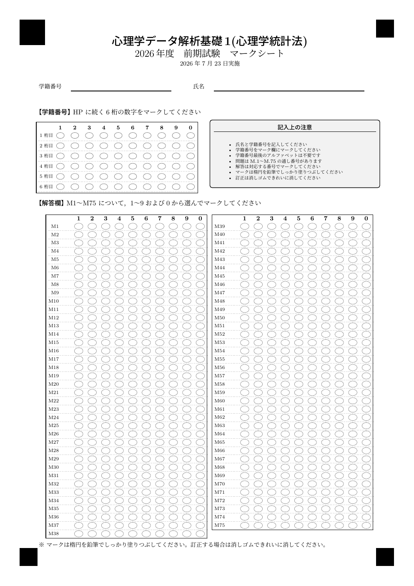
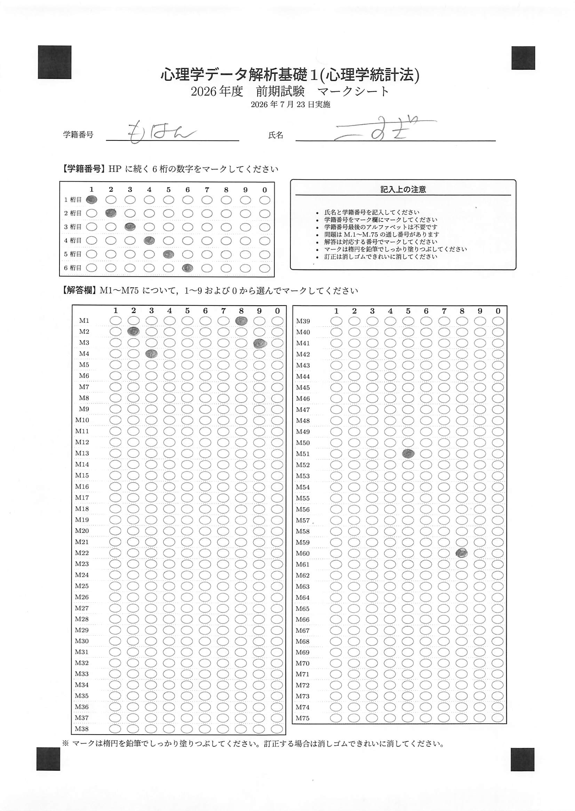
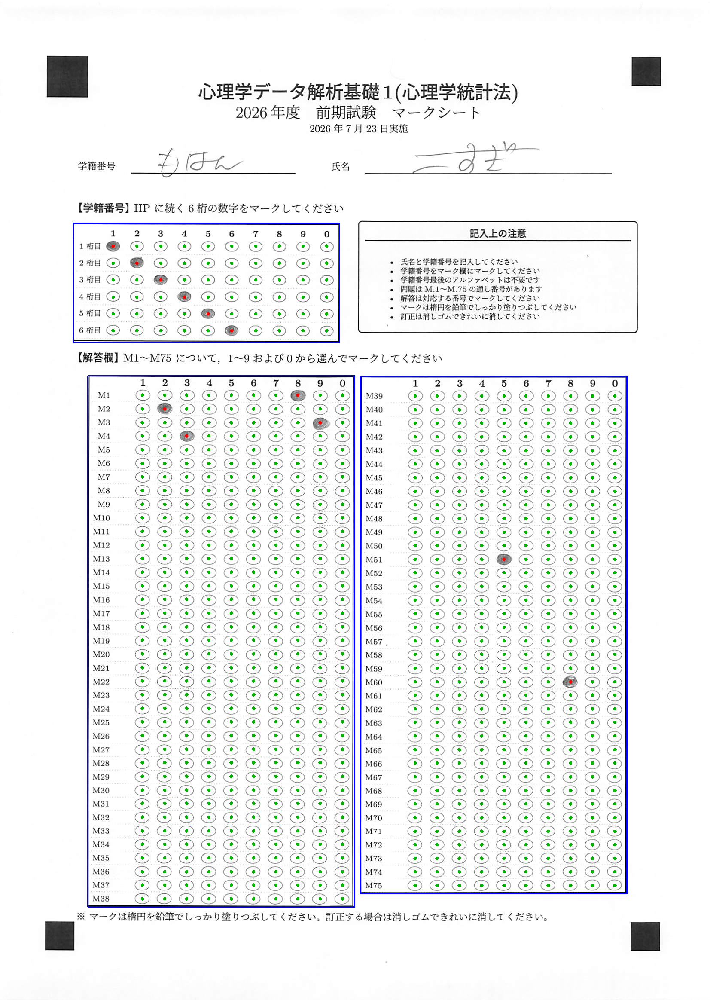
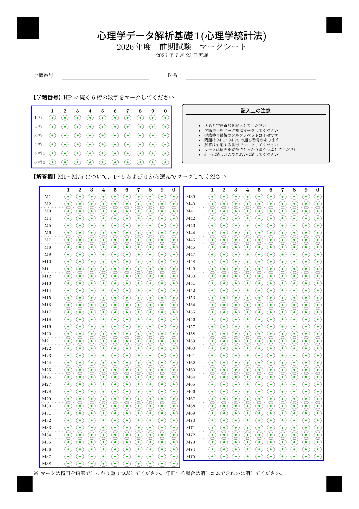

```{r, include = FALSE}
knitr::opts_chunk$set(
  collapse = TRUE,
  comment = "#>",
  eval = FALSE
)
```

`tikzomr` は，TeX/TikZ で作ったマークシートを読み取って回答を CSV 化する R パッケージです。
中心にあるのは **single source of truth**，すなわち 1 つの `config` から，

- 組版する `.tex`（＝実際に印刷する紙面）と
- 読み取り定義（各マークの座標）

が **同時に** 決まる，という設計です。読み取り位置を手で置く作業が要りません。
答案画像はすべてこの端末で処理され，クラウドには送信されません（プライバシー安全）。

> このページのコードは流れを示すためのもので，実行はしていません（組版には LuaLaTeX が要るため）。
> 掲載している画像は同梱の例（`inst/examples/`）から生成したものです。

## インストール / Install

```{r}
# 依存: R パッケージ magick, pdftools（システムに ImageMagick, poppler）
remotes::install_github("kosugitti/tikz-omr")
```

マークシートの組版には LuaLaTeX（`lualatex`）と日本語フォント環境が必要です。

## 1. マークシートを作る / Generate a sheet

`default_config()` が 2026 様式（75 問・ID 6 桁）を返します。年度で変わる所だけ差し替えます。

```{r}
library(tikzomr)

cfg <- default_config()
cfg$answer$n_questions <- 60
cfg$answer$col_split   <- list(c(1, 30), c(31, 60))
cfg$id$n_digits        <- 7

art <- make_marksheet(
  cfg,
  tex_path       = "marksheet.tex",
  marks_path     = "marksheet.marks.csv",     # 読み取り定義（座標）
  fiducials_path = "marksheet.fiducials.csv"
)
```

生成された `marksheet.tex` を **LuaLaTeX で 2 回** 組版します
（四隅マークの位置確定に `remember picture` の 2 パスが必要です）。

```{sh}
lualatex marksheet.tex && lualatex marksheet.tex
```

でき上がる紙面はこのようなものです（同梱例）。四隅の位置決めマークと，ID 欄・解答欄が並びます。

```{r, echo = FALSE, eval = TRUE, out.width = "70%", fig.alt = "生成されたマークシートの例"}

```

## 2. スキャンを読み取る / Read scans

印刷 → 試験 → ADF スキャナで PDF 化（200dpi 推奨）。読み取り定義を読み込み，スキャンを回答テーブルにします。

```{r}
layout <- list(
  marks     = read.csv("marksheet.marks.csv"),
  fiducials = read.csv("marksheet.fiducials.csv")
)

# 1 枚
res <- read_marksheet("one_scan.jpg", layout)

# 一括 — 入力は 3 通り（PDF・フォルダ・ファイル群）:
tbl <- read_marksheet_batch("all_students.pdf", layout)  # まとめ PDF 1 枚
tbl <- read_marksheet_batch("scans/", layout)            # フォルダ（中を全部）
tbl <- read_marksheet_batch(c("a.jpg", "b.pdf"), layout) # ファイル群（混在可）

write.csv(tbl, "responses.csv", row.names = FALSE)
review <- attr(tbl, "review")   # 要目視（複数塗り・ID 不明）
```

四隅の位置決めマークと射影変換（homography）で，スキャンの傾き・拡縮・平行移動を自動的に吸収します。

出力スキーマは `source, ID1..IDn, M1..Mq` です（手書き DIY 様式と互換）。
塗り率のしきい値 `fill_thr` は既定 0.13（鉛筆マーク向け。清刷り前提なら 0.20 でもよい）。

固定接頭辞（学部コードなど全員共通の先頭文字）は，印字のみでマーク対象外にできます。

```{r}
cfg$id$prefix <- "HP"   # 紙面に「先頭に HP」と刷られ，読み取り時に id 列 "HP123456" が復元される
```

## 3. 目視確認 / Eyeball a sheet

`overlay_marksheet()` は，検出したマークを重ねた注釈画像を返します。
**緑＝検出・赤＝複数塗り・青枠＝四隅** です。読み取りが正しく効いているかの確認に使います。

```{r}
ov <- overlay_marksheet("one_scan.jpg", layout)
magick::image_write(ov, "check.png")
```

<div style="display:flex; gap:1rem; flex-wrap:wrap; align-items:flex-start;">
<figure style="margin:0; max-width:48%;">
```{r, echo = FALSE, eval = TRUE, out.width = "100%", fig.alt = "スキャン原画像"}

```
<figcaption>スキャン原画像 / raw scan</figcaption>
</figure>
<figure style="margin:0; max-width:48%;">
```{r, echo = FALSE, eval = TRUE, out.width = "100%", fig.alt = "検出マークを重ねたオーバーレイ画像"}

```
<figcaption>読み取り位置オーバーレイ / detected-mark overlay</figcaption>
</figure>
</div>

空欄の紙面に読み取り位置を重ねると，格子と各マーク中心が config どおりに載っていることが分かります。

```{r, echo = FALSE, eval = TRUE, out.width = "70%", fig.alt = "空欄の紙面に読み取り位置を重ねたオーバーレイ"}

```

## 4. GUI で行う / Use the local GUI

生成と読み取りを，ブラウザの GUI「マークシート工房」で行えます（要 `shiny`, `DT`）。

```{r}
run_omr_app()
```

すべてこの端末で動き，答案画像は外部に送信されません。

## すぐ試す / Try the bundled example

同梱の 2026 様式とサンプルスキャンで，読み取りだけをすぐ試せます。

```{r}
layout <- example_layout()
res <- read_marksheet(
  system.file("examples", "sample_scan.jpg", package = "tikzomr"),
  layout
)
# ID = 123456 ; M1 = 8, M2 = 2, M3 = 9, M4 = 3, M51 = 5, M60 = 8
```

## 対象範囲 / Scope

このパッケージが担うのは **マークシートの生成と読み取り** までです。
採点・IRT などの下流処理は利用者側で行います。
設計の詳細はリポジトリの `CLAUDE.md` を参照してください。
